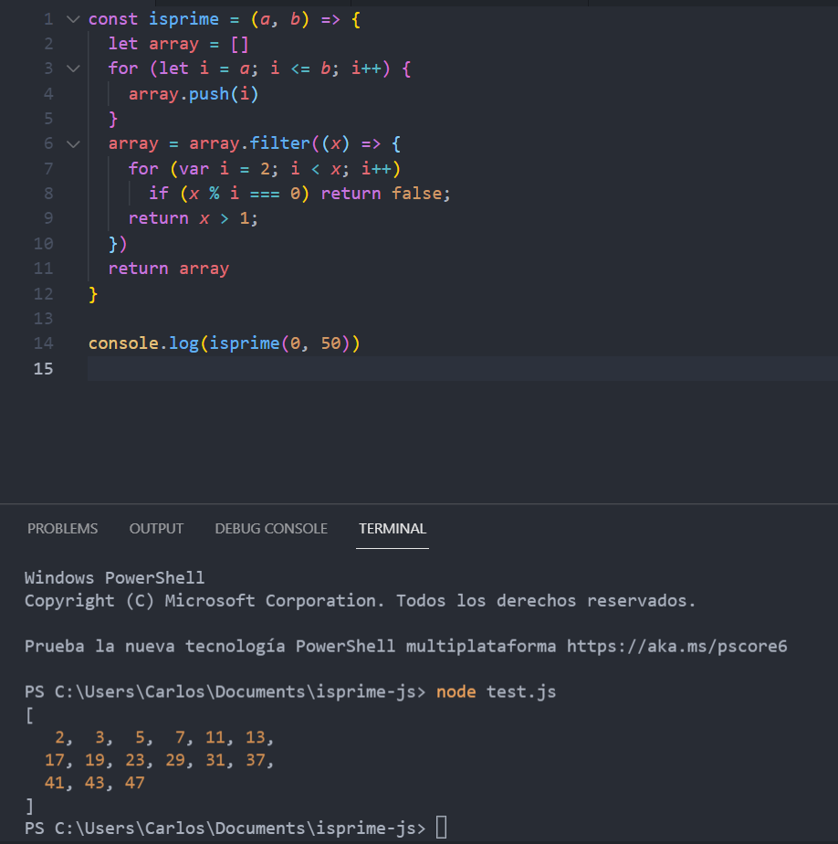

# isprime-js

In this particular repo, lays the solution for finding prime numbers between a range of numbers given by user. 

## Screenshot

## To try the solution you could just open the comand line a do a :

<code>git clone https://github.com/carloso0114/isprime-js.git </code>

then <code> cd isprime-js </code>

and last you could edit the test.js with the code editor of your preference and run the function isprime with the two arguments.
 
<code> a </code> for the starting number and <code> b </code> for the last number in the array.

 example <code> console.log(isprime(0, 50)) </code> 

then in the terminal you just need to run the test with <code> node test.js </code> 
